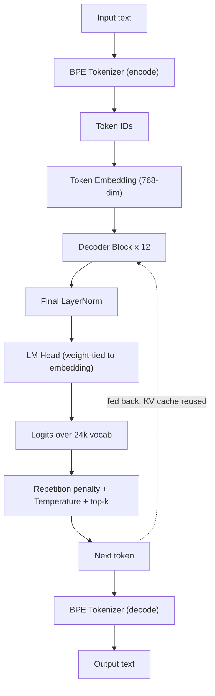
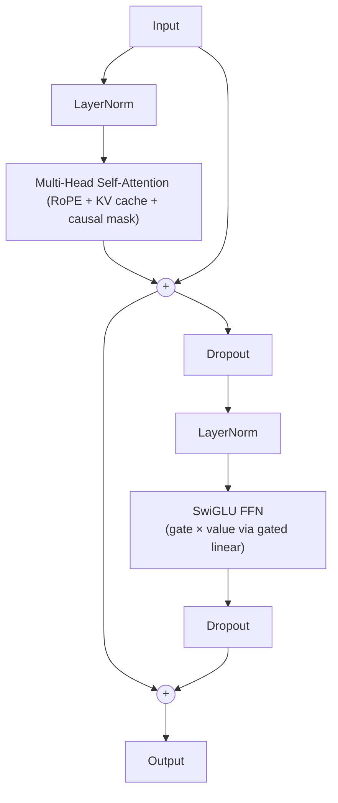

# Nova


A decoder-only transformer language model built entirely from scratch in Python/PyTorch, with a custom BPE tokenizer and complete training infrastructure. Nova is a hands-on exploration of modern LLM engineering: from tokenization through multi-stage pretraining to conversational fine-tuning.

## TL;DR

**What it does:** Encodes text → passes it through 12 stacked decoder blocks with multi-head attention and SwiGLU FFN → generates coherent (sometimes) responses via temperature/top-k sampling.

**Current state:** Complete. Nova has gone through vocabulary learning, knowledge expansion, and conversational fine-tuning, resulting in a functional end-to-end decoder-only language model.

**Key insight:** Tokenizer/corpus alignment is critical. Misalignment between tokenizer training corpus and model training data → gibberish. Phase ordering also matters because each stage provides the initialization point for the next.

---

## Architecture Overview

### High-Level Flow



### Decoder Block (x12 stacked)



**Pre-norm residual blocks** with:
- **Multi-head self-attention** (12 heads, 64 dims each)
- **Rotary Positional Embeddings (RoPE)** baking relative position into attention scores
- **KV cache** for efficient incremental decoding (no recomputation on past tokens)
- **Causal masking** preventing tokens from seeing future positions
- **SwiGLU FFN** with gating: `(linear₁(x) ⊗ σ(linear₁(x))) × linear₃(x) → linear₂(...)`

### Model Config

| Param | Value |
|-------|-------|
| **vocab_size** | 24,000 (BPE) |
| **embed_dim** | 768 |
| **num_layers** | 12 |
| **num_heads** | 12 (64 dims/head) |
| **max_seq_len** | 2,048 |
| **FFN hidden** | ⌊2 × (4 × 768) / 3⌋ = 2,048 |
| **total params** | ~100M |
| **rope_base** | 10,000 |
| **dropout** | 0.1 |
| **learning_rate** | 1e-3 |
| **default sampler** | temp=0.7, top_k=6, repetition_penalty=1.1 |

---

## Training Approach: Three Phases

Nova follows a staged training pipeline to progressively build language understanding:

### Phase 1: Vocabulary Learning (SimpleStories)
**Goal:** Establish fluency on a narrow, consistent vocabulary.

- **Dataset:** SimpleStories (sliding-window next-token prediction)
- **Loss masking:** None (all tokens supervised)
- **Outcome:** Sharp loss drop, train/test accuracy climb together; healthy convergence

**Why this first?** Tight vocabulary → fast convergence → stable loss landscape for Phase 2.

### Phase 2: Knowledge Expansion (Mixed Knowledge Dataset)
**Goal:** Inject factual/topical knowledge without catastrophic forgetting.

- **Dataset:** Mixed knowledge dataset + Phase 1 checkpoint
- **Loss masking:** None
- **Outcome:** Loss/accuracy improve from Phase 1 checkpoint; topic coherence gains observed downstream

**Why this?** Skipping Phase 2 (tried initially) → outputs partially coherent but factually wrong and repetition-collapsed. Phase 2 initialization provides richer gradient landscape, reduces forgetting risk, enables downstream fine-tuning to lock in knowledge.

**Key learning:** Phase ordering matters through *initialization point in loss landscape*, not just persisted facts.

### Phase 3: Chat Structuring (Multi-source fine-tuning)
**Goal:** Align the model to conversational formats, everyday dialogue, system instructions, and mathematical reasoning.

- **Dataset:** Mixed multi-source dataset including:
  - `smoltalk/everyday-conversation` — everyday conversational data
  - `smoltalk/systemchats-30k` — system/user/assistant instruction-style conversations
  - `openai/gsm8k` — grade-school mathematical reasoning
  - **Generated conversations** — additional synthetic conversational examples
- **Format:** `<bos> <|user|> ... <|assistant|> ... <|system|> ...`
- **Loss masking:** Only assistant tokens supervised; user/system masked out (-100)
- **Outcome:** Completed successfully, producing the final conversationally fine-tuned Nova model.

---

## Project Structure

```
Nova/
├── GPT/
│   ├── Nova.py              # NovaLM: embedding, decoder, LM head, generate() & chat()
│   ├── decoder.py           # Decoder block (pre-norm + MHA + SwiGLU FFN)
│   ├── attention.py         # BatchedMultiHeadAttention with RoPE + KV cache + causal mask
│   ├── datasets.py          # VocabDataset (pretraining) & ChatBotDataset (instruction tuning)
│   └── train.py             # Training loop, evaluation, checkpointing, metric logging
│
├── Preprocess/
│   ├── tokenizer.py         # BPE tokenizer: train(), encode(), decode()
│   ├── train_tokenizer.py   # Entry point: trains vocab.json + merges.json from corpus
│   ├── pos_embed.py         # RoPE (Rotary Positional Embeddings)
│   ├── vocab.json           # BPE vocabulary (24k tokens)
│   └── merges.json          # BPE merge rules
│
├── config.yaml              # Tokenizer, model, training, dataset config (single source of truth)
├── test.py                  # REPL: loads checkpoint, chats interactively
└── README.md                # This file
```

---

## Getting Started

### Requirements

```bash
Python 3.10+
PyTorch (with CUDA support recommended; mixed precision supported)
PyYAML
tqdm
plotly
safetensors
```

### Installation

```bash
git clone https://github.com/HmedNejjar/Nova.git
cd Nova
pip install torch pyyaml tqdm plotly safetensors
```

### Quick Start: Chat with a Trained Model

```bash
python test.py
```

This loads the checkpoint at `config.yaml:Model.savepath` and opens an interactive chat loop.

---

## Workflow: Training from Scratch

### Step 1: Prepare Corpus & Train Tokenizer

Create a file `corpus.txt` with all raw text you want the tokenizer to see (SimpleStories + Wikipedia + chat data, concatenated):

```bash
cd Preprocess
python train_tokenizer.py
```

This produces `vocab.json` (24k tokens) and `merges.json` in the `Preprocess/` directory.

**Critical:** Tokenizer must be trained on a corpus covering **all** phases' text. Misalignment → untrained embedding rows → gibberish output.

### Step 2: Preprocess Datasets

For each phase, tokenize your data:

**Phase 1 (SimpleStories):**
```python
from Preprocess.tokenizer import BPE
import pickle

tokenizer = BPE(vocab_size=24_000, savepath="Preprocess")
stories = load_raw_text("SimpleStories.txt")
token_ids = [tokenizer.encode(text) for text in stories]

with open("Preprocess/Datasets/Vocab_train.pkl", "wb") as f:
    pickle.dump(token_ids, f)
```

**Phase 3 (Chat):**
Chat data should be JSONL with a `"text"` field:
```json
{"text": "<bos> <|user|> What is 2+2? <|assistant|> 4. "}
{"text": "<bos> <|user|> Hello <|assistant|> Hi there! "}
```

Save to paths in `config.yaml:Datasets.Chat_train` / `Chat_test`.

### Step 3: Train

```bash
python GPT/train.py
```

This:
1. Loads tokenizer from `Preprocess/vocab.json` + `merges.json`
2. Loads datasets from paths in `config.yaml`
3. Initializes NovaLM with config hyperparams
4. Runs the training loop with mixed precision
5. Checkpoints best model to `config.yaml:Model.savepath` (safetensors format)
6. Logs loss/accuracy curves as interactive Plotly HTML files

### Step 4: Generate Text

```python
import torch
from GPT.Nova import NovaLM
from Preprocess.tokenizer import BPE
from safetensors.torch import load_model

tokenizer = BPE(vocab_size=24_000, savepath="Preprocess")
model = NovaLM(
    tokenizer=tokenizer,
    vocab_size=24_000,
    embed_dim=768,
    num_layers=12,
    num_heads=12,
    max_seq_len=2048,
    rope_base=10_000,
    dropout=0.1
)
load_model(model, "Model/Nova_best_model.safetensors")

# Raw completion
output = model.generate(
    prompt="Once upon a time",
    temperature=0.7,
    top_k=6,
    repetition_penalty=1.1,
    max_new_tokens=100,
    device="cuda"
)
print(output)

# Chat (multi-turn with system prompt)
response = model.chat(
    messages=[
        {"role": "system", "content": "You are a helpful assistant."},
        {"role": "user", "content": "What is machine learning?"}
    ],
    temperature=0.7,
    top_k=6,
    repetition_penalty=1.1,
    max_new_tokens=150,
    device="cuda"
)
print(response)
```

---

## Key Implementation Details

### Custom BPE Tokenizer
- Trained directly on raw text (no HuggingFace dependencies)
- Vocab size: 24,000
- Special tokens: `<bos>`, `<eos>`, `<|user|>`, `<|assistant|>`, `<|system|>`
- **Special token formatting:** Padded with spaces (`<|user|> `) to prevent BPE shattering

### Weight Tying
The output projection (`lm_head`) shares weights with the token embedding layer. This reduces parameters and accelerates convergence but requires `save_model()` / `load_model()` from safetensors (`.pth` format raises `RuntimeError` on tied weights).

### KV Cache & Incremental Decoding
During generation, keys/values from past tokens are cached and reused. Only the new token's K/V are computed and appended. RoPE offsets are tracked to maintain correct positional rotations across multiple forward passes.

### Causal Masking
Attention scores are masked so position `i` cannot attend to positions `j > i`. Implemented as an additive mask (set future positions to `-inf` before softmax).

### RoPE (Rotary Positional Embeddings)
Instead of learned positional embeddings, RoPE rotates Q and K vectors by position-dependent angles. Relative position is baked into attention scores, improving extrapolation beyond training length.

### SwiGLU FFN
The feed-forward layer uses gating:
```
gate = linear₁(x)
value = linear₃(x)
output = linear₂(SiLU(gate) ⊙ value)
```
This is more parameter-efficient than standard MLP while improving expressivity.

### Mixed Precision
Mixed-precision training is supported through PyTorch automatic mixed precision. The training setup uses the appropriate precision and gradient scaling for the available CUDA hardware.

---

## Metrics & Training Curves

Interactive Plotly charts logged per phase to `Model/Metrics/`. Hover for exact values; click/drag to zoom.

### Phase 1 (SimpleStories)
- Loss drops sharply; train/test accuracy climb together
- Minimal overfitting; narrow vocabulary converges quickly

### Phase 2 (Simple Wikipedia)
- Loss/accuracy continue improving from Phase 1 checkpoint
- Steeper curves reflect harder, knowledge-denser data

### Phase 3 (Chat)
- Metrics only on assistant-turn tokens (user/system masked)
- Reflects conversational format alignment, not free-text fluency
- Completed conversational fine-tuning and final model evaluation

---

## Design Philosophy

Nova prioritizes **understanding over convenience**:
- Custom transformer, not HuggingFace models
- Custom BPE tokenizer, not pre-trained ones
- Explicit attention implementation, not `torch.nn.MultiheadAttention`
- Detailed comments explaining each layer

The goal is to learn how LLMs work by building them from first principles. Production use is not recommended; this is a research/educational codebase.

---

## References & Inspiration

- **Decoder-only transformer:** Radford et al., "Language Models are Unsupervised Multitask Learners" (GPT-2)
- **RoPE:** Su et al., "RoFormer: Enhanced Transformer with Rotary Position Embedding" (2021)
- **SwiGLU:** Shazeer, "GLU Variants Improve Transformer" (2020)
- **KV cache:** Standard in autoregressive generation (Karpathy, Bengio notes)
- **Weight tying:** Press & Wolf, "Using the Output Embedding to Improve Language Models" (2016)

---

## Status

✅ **Project Complete — Research/Learning Focus**

Nova is a completed from-scratch LLM project covering the full pipeline from custom tokenization and multi-stage pretraining to conversational fine-tuning and autoregressive generation. The final system combines a custom BPE tokenizer, a 12-layer decoder-only Transformer with RoPE, KV caching, causal self-attention, SwiGLU feed-forward layers, weight tying, and configurable sampling.

The project is complete as an educational and research-oriented implementation. Its primary value is demonstrating how the components of an LLM fit together and how a staged training pipeline can be built and trained end to end.

---

## Contributing

Found a bug? Have an optimization idea? Issues and PRs welcome — this is a learning project, so clear explanations and good-faith feedback are valued.

---

**Built with curiosity and PyTorch. 🚀**