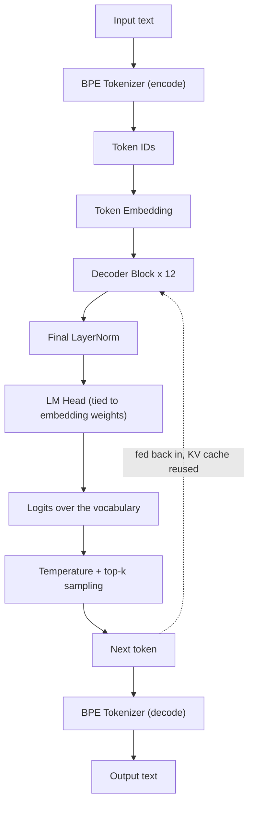
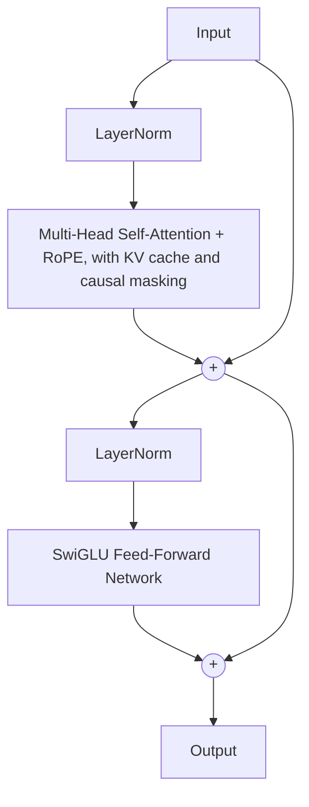

# Nova


A GPT-style language model built from scratch, with a focus on understanding and implementing the core components behind modern Large Language Models.

Nova is an ongoing exploration into how language models learn, reason, and generate text — from raw token prediction to instruction-following conversational systems.

## Overview

Nova aims to build a complete LLM pipeline, covering the fundamental stages involved in creating a conversational AI system:

- Data processing and tokenization
- Transformer-based language modeling
- Efficient autoregressive generation
- Continued model improvement through different training stages
- Instruction tuning for conversational abilities

The goal is not only to create a chatbot, but to understand the engineering and concepts behind the systems that power modern AI assistants.

## Current Features

- **Decoder-only Transformer architecture**, implemented from scratch in PyTorch
- **Custom Byte-Pair Encoding (BPE) tokenizer**, trained directly on a raw text corpus (no external tokenizer libraries)
- **Multi-head self-attention** with **Rotary Positional Embeddings (RoPE)**
- **SwiGLU feed-forward network** and pre-norm residual blocks, in the style of modern LLaMA-esque decoders
- **Weight-tying** between the token embedding and output projection layers
- **KV-cache optimization** for efficient autoregressive inference, with correctly offset RoPE and causal masking during incremental decoding
- **Autoregressive text generation** with temperature scaling and top-k sampling, plus a `chat()` wrapper that applies the `<|user|>`/`<|assistant|>` template automatically
- Dataset scaffolding for both **pretraining** (sliding-window next-token prediction) and **instruction tuning** (`<|user|>` / `<|assistant|>` formatted conversations with assistant-only loss masking)
- Mixed-precision training loop (AdamW, `torch.cuda.amp`) with per-epoch loss/accuracy tracking and Plotly-based training curves

## How Nova Works

At a high level, a prompt goes in as text and comes out as text, but everything in between is just numbers flowing through the network:



1. **Tokenize** — the prompt is split into subword pieces by the BPE tokenizer and converted to integer IDs.
2. **Embed** — each ID is looked up in a learned embedding table and turned into a 768-dim vector.
3. **Decode** — the vectors pass through 12 stacked decoder blocks (below), which is where almost all of the "thinking" happens.
4. **Project** — a final LayerNorm and a linear head (weight-tied to the embedding table) turn the last hidden vector into a score for every token in the vocabulary.
5. **Sample** — logits are scaled by temperature, cut down to the top-k most likely tokens, and one is sampled — that's the next token.
6. **Repeat** — the new token is fed back in (reusing cached attention keys/values instead of recomputing the whole sequence) until an end-of-sequence token or the length limit is hit, then the ID sequence is decoded back to text.

Zooming into a single decoder block:



- **Pre-norm + attention** — the block normalizes first, then runs multi-head self-attention. Rotary Positional Embeddings (RoPE) rotate the query/key vectors based on position instead of adding a separate positional embedding, so relative position is baked directly into the attention scores. A causal mask stops any token from attending to future tokens, and during generation the keys/values for past tokens are cached instead of recomputed.
- **Residual add** — the attention output is added back to the block's input (a skip connection), which keeps gradients flowing through deep stacks.
- **Pre-norm + SwiGLU FFN** — the result is normalized again and passed through a gated feed-forward network: one linear layer produces a "gate," another produces a "value," the gate is passed through SiLU and multiplied elementwise with the value, then projected back down to the embedding size.
- **Residual add** — same skip-connection pattern, giving the final output of the block.

Twelve of these blocks are stacked to form the full decoder, and this same architecture is reused unchanged across all three training phases below — only the data and loss masking change.

## Project Structure

```
Nova/
├── GPT/
│   ├── Nova.py        # NovaLM: embedding, decoder, LM head, generate() and chat()
│   ├── attention.py   # Multi-head self-attention with RoPE + KV cache
│   ├── decoder.py      # Decoder block (pre-norm attention + SwiGLU FFN)
│   ├── datasets.py     # VocabDataset (pretraining) & ChatBotDataset (instruction tuning)
│   └── train.py        # Training loop, evaluation, and metric plotting
├── Preprocess/
│   ├── tokenizer.py        # BPE tokenizer: training, encode/decode
│   ├── train_tokenizer.py  # Script to train and save a BPE vocab/merges
│   └── pos_embed.py        # Rotary Positional Embedding (RoPE) implementation
├── config.yaml         # Tokenizer, model, training, and dataset configuration
├── test.py             # Loads a checkpoint and chats with it from the command line
└── README.md
```

## Getting Started

### Requirements

- Python 3.10+
- [PyTorch](https://pytorch.org/)
- PyYAML
- tqdm
- plotly

```bash
git clone https://github.com/HmedNejjar/Nova.git
cd Nova
pip install torch pyyaml tqdm plotly
```

### Configuration

All hyperparameters and paths are controlled through `config.yaml`:

```yaml
Tokenizer:
    type: "Byte-Pair Encoding"
    savepath: "Preprocess"
    corpus_path: "corpus.txt"
    vocab_size: 24_000

Model:
    embed_dim: 768
    num_heads: 12
    max_seq_len: 768
    num_layers: 12
    stride_coeff: 2
    learning_rate: 1e-4
    dropout: 0.1
    rope_base: 10_000
    savepath: "Model/Nova_best_model.pth"
    top_k: 10
    temperature: 0.2

Train:
    epochs: 10
    batch_size: 8

Datasets:
    SimpleStories_train: "Preprocess/Datasets/Vocab_train.pkl"
    SimpleStories_test: "Preprocess/Datasets/Vocab_test.pkl"

    Mixed_knowledge_train: "Preprocess/Datasets/Mixed_knowledge_train.pkl"
    Mixed_knowledge_test: "Preprocess/Datasets/Mixed_knowledge_test.pkl"

    UltraChat_train: "Preprocess/Datasets/chat_train.jsonl"
    UltraChat_test: "Preprocess/Datasets/chat_test.jsonl"

Metrics:
    savepath: "Model/Metrics"
```

Each `Datasets` entry points to a pickled list of token IDs (or, for `ChatBotDataset`, a json file containing raw `<|user|>`/`<|assistant|>`-formatted conversation strings) produced by your own preprocessing — one pair per training phase described below.

### Training the tokenizer

The BPE tokenizer is trained directly on a raw text corpus (`Tokenizer.corpus_path` in `config.yaml`) and saves `vocab.json` / `merges.json` to the configured `savepath`.

```bash
cd Preprocess
python train_tokenizer.py
```

### Training the model

Once the tokenizer is trained and a tokenized dataset (pickled token ID lists, referenced under `Datasets` in `config.yaml`) is available, run:

```bash
python GPT/train.py
```

This trains `NovaLM` with AdamW and mixed precision, tracks train/eval loss and token-level accuracy per epoch, checkpoints the best model, and writes `loss_metrics.html` / `accuracy_metrics.html` (interactive Plotly charts) to the project root.

### Generating text

The tokenizer is passed in once, at construction time, and stored on the model. `NovaLM` then exposes two generation methods, both using the KV cache with temperature-scaled, top-k sampling:

- `generate()` — raw next-token sampling from a plain string prompt
- `chat()` — wraps `generate()` with the `<bos> <|user|> ... <|assistant|> ...` template and splits the result back into user/assistant turns

```python
import torch
from GPT.Nova import NovaLM
from Preprocess.tokenizer import BPE

tokenizer = BPE(vocab_size=24_000, savepath="Preprocess")
model = NovaLM(tokenizer=tokenizer, vocab_size=24_000, embed_dim=768, num_layers=12,
               num_heads=12, max_seq_len=768, rope_base=10_000, dropout=0.1)
load_model(Nova, "Model/Nova_best_model.safetensors")

# Raw completion
print(model.generate("Once upon a time", temperature=0.2, top_k=10, max_new_tokens=100, device="cpu"))

# Chat-formatted turn
print(model.chat("What's the tallest mountain in the world?", temperature=0.2, top_k=10, max_new_tokens=60, device="cpu"))
```

`test.py` wraps this into a small REPL — run `python test.py` from the project root to load the checkpoint at `Model.savepath` and chat with it from the command line.

## Training Approach

The current training flow in this repo supports both token-level language modeling and chat-style fine-tuning, using the dataset configuration in `config.yaml`.

- `VocabDataset` is used for sliding-window next-token prediction over tokenized corpora such as the SimpleStories and mixed-knowledge datasets.
- `ChatBotDataset` is used for conversational training with JSONL chat examples loaded from `Preprocess/Datasets/chat_train.jsonl` and `chat_test.jsonl`.

The chat dataset is loaded by reading each JSON record, taking its `text` field, and passing it to `ChatBotDataset`, which then formats the conversation with `<bos>`, `<|user|>`, `<|assistant|>`, and `<|system|>` markers and masks the loss to only supervise assistant outputs.

This means the current chat-training pipeline is based on the raw conversation text in the JSONL files rather than a separate UltraChat preprocessing step or a dedicated "phase 3" dataset loader.

## Training Metrics
 
Loss and accuracy curves logged by `train.py` for each phase, saved to [`Metrics/`](Metrics). Each image below is clickable and opens the corresponding interactive Plotly chart (zoom, pan, hover for exact values).
 
### Phase 1 — Vocabulary Learning (SimpleStories)
 
[](https://htmlpreview.github.io/?https://raw.githubusercontent.com/HmedNejjar/Nova/main/Metrics/Phase%201/loss_metrics%20phase%201.html) [](https://htmlpreview.github.io/?https://raw.githubusercontent.com/HmedNejjar/Nova/main/Metrics/Phase%201/accuracy_metrics%20phase%201.html)
 
Loss drops sharply in the first couple of epochs and keeps converging; train and test accuracy climb together and stay close through most of training, with only a mild, expected gap opening up late — healthy behavior for this narrow-vocabulary phase.
 
### Phase 2 — Knowledge Expansion (Simple Wikipedia)
 
[](https://htmlpreview.github.io/?https://raw.githubusercontent.com/HmedNejjar/Nova/main/Metrics/Phase%202/loss_metrics%20phase%202.html) [](https://htmlpreview.github.io/?https://raw.githubusercontent.com/HmedNejjar/Nova/main/Metrics/Phase%202/accuracy_metrics%20phase%202.html)
 
Loss and accuracy continue improving from the phase 1 checkpoint on the harder, more knowledge-dense Simple Wikipedia data, reflecting the jump in vocabulary and factual content compared to the simple-story corpus.
 
### Phase 3 — Chat Structuring (UltraChat)
 
[](https://htmlpreview.github.io/?https://raw.githubusercontent.com/HmedNejjar/Nova/main/Metrics/Phase%203/loss_metrics%20phase%203.html) [](https://htmlpreview.github.io/?https://raw.githubusercontent.com/HmedNejjar/Nova/main/Metrics/Phase%203/accuracy_metrics%20phase%203.html)
 
Metrics here are computed only over assistant-turn tokens (everything else is loss-masked), so they reflect how well Nova learned to produce replies in the `<|user|>` / `<|assistant|>` chat format rather than raw next-token prediction over free text.

## Vision

The long-term goal of Nova is to develop a fully functional conversational language model while exploring the complete lifecycle of an LLM:

```
Raw Text
   ↓
Tokenization
   ↓
Pretraining
   ↓
Knowledge Expansion
   ↓
Instruction Tuning
   ↓
Conversational AI
```

## Why Nova?

Many AI systems are used without understanding what happens underneath. Nova is an attempt to bridge that gap by building the components from the ground up and exploring the ideas behind modern language models through implementation.

## Status

⚠️ Nova is still under active development.

The repo already includes the core building blocks for a decoder-only transformer: custom BPE tokenization, RoPE-based attention, KV-cached generation, chat-format training data handling, and a training/evaluation loop with metric logging. However, this is not a finished or benchmarked production model, and the current implementation is best treated as an experimental research project.

Future work may include further dataset refinement, longer training runs, tuning of the chat objective, and architectural experiments. The project is functional as a learning/codebase prototype, but it is still evolving.

### ⚠️ Note:
Nova is currently a small model, so don't expect GPT-4-level output — some incoherent, repetitive, or factually wrong responses are normal at this scale. The point of this project is the pipeline and the implementation, not chart-topping benchmarks.