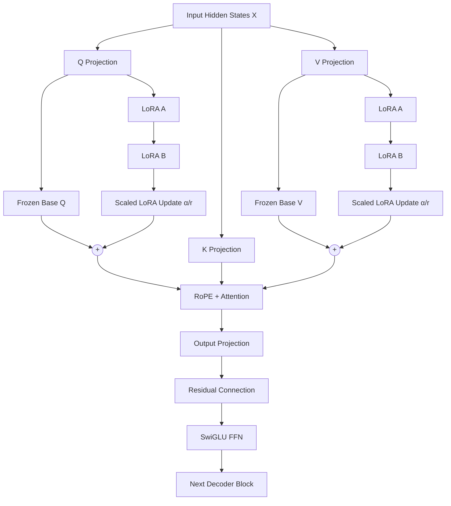

# Nova — Q/V LoRA


A parameter-efficient fine-tuning branch of **Nova**, a decoder-only Transformer language model built from scratch in Python/PyTorch.

This branch adds **LoRA (Low-Rank Adaptation) to the Query and Value projections of every self-attention layer**, allowing the pretrained Nova weights to remain frozen while a small set of trainable low-rank matrices adapts the model.

> Branch: `Nova-QV-LoRA`

## Overview

Nova is a custom decoder-only Transformer with a BPE tokenizer, RoPE positional encoding, causal self-attention, SwiGLU feed-forward networks, weight tying, and KV caching.

The purpose of this branch is to experiment with **parameter-efficient adaptation** rather than updating the entire model during fine-tuning.

The LoRA path is applied specifically to:

- `q_proj` — Query projection
- `v_proj` — Value projection

The Key projection and the output projection remain unchanged.

## What Changed in This Branch

Compared with the base Nova implementation, this branch adds:

1. A reusable `LoRALinear` module.
2. Optional LoRA wrapping for Q and V projections in attention.
3. LoRA hyperparameters in `config.yaml`.
4. Automatic freezing of the original model when LoRA is enabled.
5. Checkpoint loading that maps ordinary Q/V linear weights into the corresponding LoRA base layers.
6. Saving/loading of the resulting LoRA-enabled model with `safetensors`.

The implementation lives primarily in `GPT/LoRA.py`, `GPT/attention.py`, `GPT/decoder.py`, and `GPT/Nova.py`. citehttps://github.com/HmedNejjar/Nova/blob/Nova-QV-LoRA/GPT/LoRA.pyhttps://github.com/HmedNejjar/Nova/blob/Nova-QV-LoRA/GPT/attention.py

## LoRA Architecture

The Q/V LoRA path used in this branch can be visualized as:



For a normal linear projection:

```text
Y = W X
```

This branch augments the frozen projection with a trainable low-rank update:

```text
Y = W X + (α / r) B(A(X))
```

where:

- `W` is the original frozen projection matrix
- `A` projects from the model dimension to the LoRA rank
- `B` projects back to the original output dimension
- `r` is the LoRA rank
- `α` controls the update scaling

The implementation initializes `A` with Kaiming initialization and `B` to zeros, while freezing the original linear layer. 

### Attention Flow

Each attention block computes Q, K, and V from the normalized hidden states. Only Q and V receive LoRA adapters; K remains a standard frozen projection.

LoRA is enabled conditionally, so the same attention implementation can operate with or without Q/V adapters. 
## Base Model Architecture

The underlying Nova model remains a 12-layer decoder-only Transformer:

```text
Input tokens
    │
    ▼
BPE Tokenizer
    │
    ▼
Token Embedding (768)
    │
    ▼
┌───────────────────────────────┐
│ Decoder Block × 12            │
│                               │
│ LayerNorm                     │
│   ↓                           │
│ Multi-Head Self-Attention     │
│   ├── Q + LoRA                │
│   ├── K                       │
│   └── V + LoRA                │
│   ↓                           │
│ Residual                      │
│   ↓                           │
│ LayerNorm                     │
│   ↓                           │
│ SwiGLU FFN                    │
│   ↓                           │
│ Residual                      │
└───────────────────────────────┘
    │
    ▼
Final LayerNorm
    │
    ▼
Tied LM Head
    │
    ▼
24k-token vocabulary
```

The decoder uses 12 attention heads, 64 dimensions per head, RoPE, KV caching, and a SwiGLU feed-forward network.

## Configuration

The branch configuration currently specifies:

| Parameter | Value |
|---|---:|
| Vocabulary size | 24,000 |
| Embedding dimension | 768 |
| Attention heads | 12 |
| Head dimension | 64 |
| Decoder layers | 12 |
| Maximum sequence length | 1,024 |
| RoPE base | 10,000 |
| Dropout | 0.1 |
| LoRA rank | 8 |
| LoRA alpha | 16 |
| LoRA dropout | 0.05 |
| Learning rate | 1e-3 |
| Epochs | 1 |
| Batch size | 8 |
| Top-k | 5 |
| Temperature | 0.5 |
| Repetition penalty | 1.1 |

These values come directly from the branch's `config.yaml`.

## Trainable Parameters

When `apply_LoRA=True`, Nova freezes every parameter whose name does not contain `lora`.

Therefore the trainable parameters are the LoRA matrices only:

```text
q_proj.lora_A
q_proj.lora_B
v_proj.lora_A
v_proj.lora_B
```

for each of the 12 decoder layers.

The base Q, K, V, output projections, embeddings, normalization layers, and SwiGLU parameters remain frozen.

For the configured dimensions (`d = 768`, `r = 8`), one LoRA adapter on a projection contains:

```text
a: 768 × 8 = 6,144 parameters
b: 8 × 768 = 6,144 parameters
--------------------------------
total:        12,288 parameters
```

With both Q and V adapted, that is **24,576 trainable LoRA parameters per decoder layer**, before accounting for any implementation-specific parameter-count reporting.

## Checkpoint Loading

This branch is designed to start from a pretrained Nova checkpoint rather than training the base model again.

When a checkpoint contains ordinary Q/V projection weights, the training script maps them into:

```text
q_proj.base_linear.*
v_proj.base_linear.*
```

The LoRA matrices are left as their LoRA initialization when they are not present in the checkpoint.

Once a LoRA checkpoint has been saved, rerunning training loads the saved LoRA weights instead of creating fresh adapters.

## Training Data

The branch configuration points its chat dataset entries to:

```text
Preprocess/Datasets/math_train.jsonl
Preprocess/Datasets/math_test.jsonl
```

The training pipeline reads JSONL records containing a `text` field and constructs `ChatBotDataset` instances for these conversation files.

## Training Pipeline

Run:

```bash
python GPT/train.py
```

The script:

1. Loads the tokenizer.
2. Instantiates Nova with Q/V LoRA enabled.
3. Loads an existing LoRA/base checkpoint when available.
4. Loads the tokenized vocabulary and chat datasets.
5. Builds the training components.
6. Optimizes only parameters with `requires_grad=True`.
7. Evaluates the model and saves the best checkpoint in `safetensors` format.
8. Writes metric history and Plotly HTML curves.

The optimizer is created from the trainable subset of the model, so frozen base parameters are not updated.

## Inference

The normal Nova generation and chat interfaces remain available.

```python
response = model.chat(
    messages=[
        {"role": "user", "content": "What is 12 × 8?"}
    ],
    temperature=0.5,
    top_k=5,
    repetition_penalty=1.1,
    max_new_tokens=150,
    device="cuda"
)

print(response)
```

Generation still uses temperature scaling, top-k filtering, repetition penalty, EOS stopping, and KV caching.

## Project Structure

```text
Nova/
├── GPT/
│   ├── LoRA.py          # LoRALinear implementation
│   ├── Nova.py          # NovaLM + LoRA parameter freezing + generation/chat
│   ├── attention.py     # Multi-head attention + Q/V LoRA integration
│   ├── datasets.py      # Vocabulary and chat datasets
│   ├── decoder.py       # Transformer decoder blocks
│   └── train.py         # LoRA training, checkpointing and metrics
│
├── Metrics/             # Training/evaluation outputs
├── Preprocess/          # BPE tokenizer and preprocessing assets
├── config.yaml          # Model, LoRA and training configuration
└── test.py              # Interactive inference
```

## Installation

```bash
git clone https://github.com/HmedNejjar/Nova.git
cd Nova
git checkout Nova-QV-LoRA

pip install torch pyyaml tqdm plotly safetensors
```

CUDA is recommended for training.

## Why Q/V LoRA?

Attention projections are natural places to test parameter-efficient adaptation because they directly control how information is selected and represented during attention.

This branch therefore keeps the pretrained language model intact and learns a small number of additional parameters in the Query and Value paths instead of updating the full model.

That gives Nova a clean experimental setup for comparing:

```text
Full fine-tuning
        vs.
Q/V LoRA fine-tuning
```

while keeping the base architecture unchanged.

## Branch Scope

This branch is specifically focused on **Q/V LoRA adaptation of Nova**. It is not a new base architecture; it is an experimental fine-tuning path built on top of the existing Nova Transformer.

## Notes on Reproducibility

The repository currently contains both vocabulary and chat dataloaders. The training script constructs the chat datasets, but the final call to the training loop passes the vocabulary dataloaders. Consequently, anyone reproducing the branch should inspect the dataloader tuple in `GPT/train.py` before assuming that `train.jsonl` / `test.jsonl` are the datasets actually used for the optimization step.

## License

See the repository for the project's licensing information.

---

**Nova-QV-LoRA — parameter-efficient adaptation of a Transformer built from scratch.**
