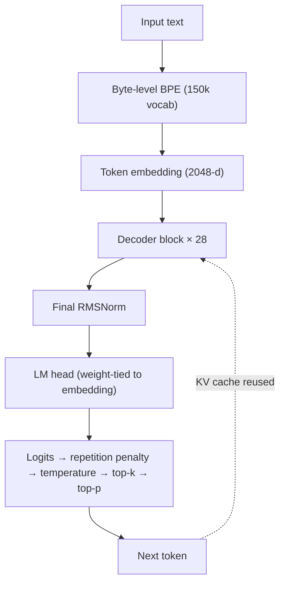
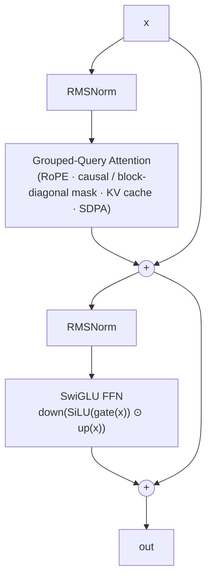
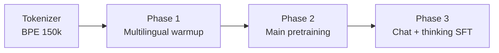

<p align="center">
  
</p>

<p align="center">
  <b>A ~1.6B-parameter, multilingual, decoder-only language model built from scratch in PyTorch.</b>
</p>

<p align="center">
  
  
  
  
  <a href="https://huggingface.co/HmedNejjar/Nova"></a>
</p>

---

## Overview

Nova is a GPT-style language model written from first principles, with no `transformers` model classes. The architecture, data packing, training loop, checkpointing and metrics are all implemented in this repo.

**Nova 2.0**  scales the original ~100M-parameter Nova 1.0 up to a modern ~1.6B-parameter architecture. It is multilingual and fine-tuned for chat, including a `<thinking>` reasoning mode.

| | Nova 1.0 | **Nova 2.0** |
|---|---|---|
| Parameters | ~100M | **~1.6B** |
| Layers × width | 12 × 768 | **28 × 2048** |
| Attention | MHA, 12 heads | **GQA, 16 query / 8 KV heads** |
| Normalization | LayerNorm | **RMSNorm** |
| Tokenizer | Custom Python BPE, 24k | **Byte-level BPE (🤗 `tokenizers`), 150k** |
| Context | 2,048 | **up to 32,768 (RoPE base 100k)** |
| Languages | English | **English, French, Arabic, Chinese, Japanese + code** |
| Data pipeline | Pickled token lists | **Packed `.npy` shards + doc-boundary masks** |
| Sampling | temperature, top-k | **greedy, temperature, top-k, top-p** |

---

## Architecture


```mermaid
flowchart TD
    A["Input text"] --> B["Byte-level BPE (150k vocab)"]
    B --> C["Token embedding (2048-d)"]
    C --> D["Decoder block × 28"]
    D --> E["Final RMSNorm"]
    E --> F["LM head (weight-tied to embedding)"]
    F --> G["Logits → repetition penalty → temperature → top-k → top-p"]
    G --> H["Next token"]
    H -.->|"KV cache reused"| D
```

### Decoder block (pre-norm)


```mermaid
flowchart TD
    X["x"] --> N1["RMSNorm"]
    N1 --> ATT["Grouped-Query Attention<br/>(RoPE · causal / block-diagonal mask · KV cache · SDPA)"]
    ATT --> A1(("+"))
    X --> A1
    A1 --> N2["RMSNorm"]
    N2 --> FFN["SwiGLU FFN<br/>down(SiLU(gate(x)) ⊙ up(x))"]
    FFN --> A2(("+"))
    A1 --> A2
    A2 --> OUT["out"]
```

- **Grouped-Query Attention** ([GPT/attention.py](GPT/attention.py)): 16 query heads share 8 KV heads, halving KV-cache memory. Uses PyTorch `scaled_dot_product_attention` with `enable_gqa=True`.
- **RoPE** ([Preprocess/pos_embed.py](Preprocess/pos_embed.py)): rotary embeddings with explicit `position_ids`, so positions reset at every packed-document boundary.
- **SwiGLU FFN + RMSNorm** ([GPT/decoder.py](GPT/decoder.py)), no biases, activation checkpointing during training.
- **Weight tying** between embedding and LM head. Residual output projections (`out_proj`, `down_proj`) use scaled init `0.02 / √(2·L)`.
- **Chunked LM loss** ([Training/eval.py](Training/eval.py)): the `(B, T, 150k)` logits tensor is never materialized at once.

### Model config ([config.yaml](config.yaml))

| Param | Value |
|---|---|
| `vocab_size` | 150,000 |
| `embed_dim` | 2,048 |
| `num_layers` | 28 |
| `num_heads` / `num_kv_heads` | 16 / 8 |
| `head_dim` | 128 |
| `hidden_dim` (SwiGLU) | 5,504 |
| `max_seq_len` | 32,768 |
| `rope_base` | 100,000 |
| `dropout` | 0.0 |
| `eps` | 1e-6 |
| Total params | ≈ 1.61B (tied) |

---

## Training pipeline

Nova is trained in three phases, and each one initializes from the previous phase's weights.


```mermaid
flowchart LR
    T["Tokenizer<br/>BPE 150k"] --> P1["Phase 1<br/>Multilingual warmup"]
    P1 --> P2["Phase 2<br/>Main pretraining"]
    P2 --> P3["Phase 3<br/>Chat + thinking SFT"]
```

| Phase | Goal | Supervision |
|---|---|---|
| **1 · Warmup** | Establish multilingual fluency | Every token (next-token prediction) |
| **2 · Pretraining** | Broaden knowledge, languages and code | Every token except `<pad>` |
| **3 · Chat SFT** | Conversation, instruction following, `<thinking>` reasoning, identity | Assistant spans only (`-100` elsewhere) |

**Chat format (Phase 3):**
```
<bos><system>…</system><user>…</user><assistant>[<thinking>…</thinking>]answer</assistant><eos>
```

### Packing & masking
All three phases use the same approach ([GPT/datasets.py](GPT/datasets.py)):
- Documents or conversations are packed into fixed-length blocks, stored as `.npy` shards with a `manifest.json` and their **boundaries** (CSR `bpos`/`bptr` arrays, or conversation tables in Phase 3).
- The collate function builds a **block-diagonal causal mask**, so tokens never attend across documents. It also builds **per-document `position_ids`** so RoPE restarts at 0, and masks the cross-document transition target as well as `<pad>` targets.
- Shards are shuffled per epoch with a worker-shared seed and can **skip already-seen blocks on resume**, so a resumed run continues on exactly the next data.

### Optimizer & schedule
- AdamW (β = 0.9, 0.95, fused on CUDA), no weight decay on norms or biases.
- Linear warmup → cosine decay to `min_lr`, gradient clipping at 1.0.
- bf16 autocast where supported (fp16 + `GradScaler` fallback), TF32 matmuls, `torch.compile` when Triton is available.

| Phase | LR | Min LR | Warmup | Steps | Micro-batch × Accum |
|---|---|---|---|---|---|
| 1 | 5e-4 | 3e-5 | 1,500 | 39,936 | 4 × 16 |
| 2 | 3e-4 | 2e-5 | 1,500 | 39,936 | 4 × 16 |
| 3 | 5e-4 | 2e-5 | 1,500 | 39,936 | 4 × 16 |

---

## Project structure

```
Nova/
├── GPT/
│   ├── Nova.py              # NovaLM: embedding → decoder → RMSNorm → tied LM head; generate() & chat()
│   ├── decoder.py           # RMSNorm, DecoderBlock (GQA + SwiGLU), Decoder stack
│   ├── attention.py         # GroupedQueryAttention with RoPE, KV cache, SDPA
│   └── datasets.py          # Phase_1_2_Dataset & Phase3Dataset (sharded, resumable, packed)
│
├── Preprocess/
│   ├── Tokenizer/
│   │   ├── tokenizer.py        # Byte-level BPE wrapper around 🤗 tokenizers
│   │   ├── train_tokenizer.py  # Trains tokenizer.json from corpus.txt
│   │   └── tokenizer.json      # Trained 150k vocabulary
│   ├── Datasets/            # Per-phase packed shards (paths set in config.yaml)
│   └── pos_embed.py         # Rotary positional embeddings (RoPE)
│
├── Training/
│   ├── train.py             # Entry point: --phase / --resume / --init-from
│   ├── optimizer.py         # AdamW param groups + warmup-cosine scheduler
│   ├── eval.py              # Chunked loss, evaluation, sample generations
│   ├── checkpoints.py       # safetensors weights + optimizer/RNG state, rotation
│   ├── metrics.py           # JSONL metric tracking + Plotly charts
│   └── utils.py             # Config, seeding, precision, dataloaders
│
├── Logo/                    # Nova logo assets
├── config.yaml              # Single source of truth for tokenizer, model, training, data paths
├── test.py                  # CLI: interactive chat (Phase 3) or text generation (Phase 1/2)
└── README.md
```

---

## Getting started

### Requirements

- Python 3.10+
- PyTorch **2.5+** (for `enable_gqa` in SDPA), with a CUDA GPU with bf16 support recommended
- `tokenizers`, `numpy`, `safetensors`, `pyyaml`, `tqdm`, `plotly`

```bash
git clone https://github.com/HmedNejjar/Nova.git
```

```bash
pip install torch tokenizers numpy safetensors pyyaml tqdm plotly triton-windows<3.3
```

### 1. Train the tokenizer

Put the raw text you want the tokenizer to learn from in `corpus.txt` at the repo root, then run:

```bash
python Preprocess/Tokenizer/train_tokenizer.py
```

This writes `Preprocess/Tokenizer/tokenizer.json` with the special tokens `<bos> <eos> <system> </system> <user> </user> <assistant> </assistant> <thinking> </thinking> <pad> <unk>`.

> **Tip:** Tokenizer/corpus alignment matters. The corpus should cover every language and every phase's data. A tokenizer that never saw a phase's text leaves undertrained embedding rows, and the model outputs gibberish on that text.

### 2. Prepare the data

Each phase reads packed `.npy` shards plus a `manifest.json` from the `train` and `test` folders set under `Datasets` in `config.yaml`. See [GPT/datasets.py](GPT/datasets.py) and [Preprocess/common.py](Preprocess/common.py) for the expected layout.

### 3. Train

```bash
python Training/train.py --phase 1
```

```bash
python Training/train.py --phase 2 --init-from Model/Checkpoints/Phase_1/final
```

```bash
python Training/train.py --phase 3 --init-from Model/Checkpoints/Phase_2/final
```

Resume an interrupted run (restores the optimizer, scheduler, RNG and data position):

```bash
python Training/train.py --phase 2 --resume Model/Checkpoints/Phase_2
```

**Outputs**
- `Model/Checkpoints/Phase_N/step_*`: rolling checkpoints (`model.safetensors` + `state.pt`), keeping the last `keep_last`
- `Model/Checkpoints/Phase_N/final`: final weights
- `Model/Metrics/Phase_N/`: `train.jsonl`, `eval.jsonl` (including sample generations), and interactive Plotly loss/accuracy charts

### 4. Chat & generate

The fastest way to try a trained model is `test.py`, which loads `Model/Checkpoints/Phase_N/final`:

```bash
python test.py --chat                                  # interactive chat with the Phase 3 model
python test.py --chat --show-thinking                  # also print the <thinking> section
python test.py --generate --phase 2 --prompt "The future of AI is"
```

| Flag | Default | Description |
|---|---|---|
| `--chat` / `--generate` | (one required) | Chat with Phase 3, or complete raw text with Phase 1/2 |
| `--phase` | — | `1` or `2`, required with `--generate` |
| `--prompt` | asked interactively | Prompt for `--generate` |
| `--max-new-tokens` | 128 | Maximum tokens to generate |
| `--temperature` | `Generation.temperature` | `0` = greedy |
| `--top-k` | `Generation.top_k` | `0` = disabled |
| `--top-p` | 1.0 | `1.0` = disabled |
| `--repetition-penalty` | `Generation.repetition_penalty` | Penalty on already-seen tokens |
| `--device` | `cuda` if available | e.g. `cuda:0`, `cpu` |

In chat mode, type `/clear` to reset the history and `exit`, `quit` or `bye` to leave.

To use the model from Python:

```python
import yaml
from safetensors.torch import load_model
from GPT.Nova import NovaLM

config = yaml.safe_load(open("config.yaml", encoding="utf-8"))
model = NovaLM(config).to("cuda")
load_model(model, "Model/Checkpoints/Phase_3/final/model.safetensors")

gen = config["Generation"]
thinking, answer = model.chat(
    [{"role": "user", "content": "What is the capital of France?"}],
    system_prompt=gen["default_sys_prompt"],
    temperature=gen["temperature"],
    top_k=gen["top_k"],
    repetition_penalty=gen["repetition_penalty"],
    return_thinking=True,
)
print(answer)
```

`chat()` formats the conversations and trims the oldest turns to fit the context. It stops at `</assistant>` or `<eos>`. For raw text completion, use `model.generate(prompt, ...)`; `temperature=0` gives greedy decoding.

---

## Design philosophy

Nova puts **understanding over convenience**:
- The transformer is hand-written: attention, RoPE, RMSNorm, SwiGLU, KV cache.
- It has a custom data format and loaders instead of a black-box training framework.
- Everything is driven by one `config.yaml`.
- Training is fully resumable (bit-exact data position, RNG and optimizer state).

It's a research and learning project. It isn't intended for production use.

---

## References

- Radford et al., *Language Models are Unsupervised Multitask Learners* (GPT-2), 2019
- Su et al., *RoFormer: Enhanced Transformer with Rotary Position Embedding*, 2021
- Shazeer, *GLU Variants Improve Transformer*, 2020
- Zhang & Sennrich, *Root Mean Square Layer Normalization*, 2019
- Ainslie et al., *GQA: Training Generalized Multi-Query Transformer Models*, 2023
- Press & Wolf, *Using the Output Embedding to Improve Language Models*, 2016

---

## Contributing

Issues and PRs are welcome. This is a learning project, so clear explanations and good-faith feedback are especially appreciated.

<p align="center">
  <br>
  <span style="font-size: 14px;">Built with curiosity and PyTorch.</span>
</p>
